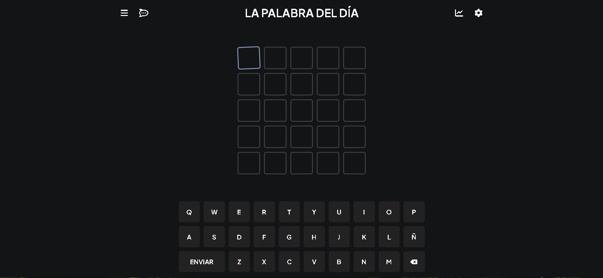
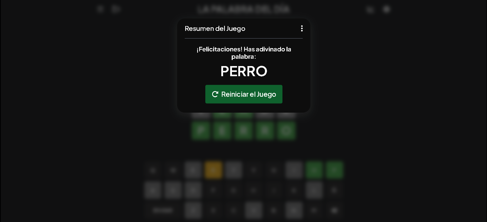

# Funny Wordle

El proyecto "Funny Wordle" es una aplicación web interactiva desarrollada utilizando HTML, CSS y JavaScript vanilla. El objetivo de este proyecto es recrear la experiencia del popular juego de adivinanza de palabras, Wordle, donde los jugadores deben adivinar una palabra oculta en un número limitado de intentos.

## Demo

[Demo](https://funnygame.vercel.app)

## Capturas de Pantalla

## Funcionalidades

- **Interfaz de Usuario Intuitiva:** Las imágenes se muestran en una cuadrícula según sus dimensiones, clasificadas en anchas, altas o grandes.
- **Juego de Adivinanza:** Los jugadores tienen cinco intentos para adivinar una palabra de cinco letras. Después de cada intento, se proporciona retroalimentación sobre qué letras están en la palabra correcta y si están en la posición correcta.
- **Validación de Palabras:** El sistema valida las palabras ingresadas por los jugadores para asegurarse de que sean palabras válidas en el idioma correspondiente.
## Tecnologías Empleadas

**Frontend:** HTML, CSS y Javascript
